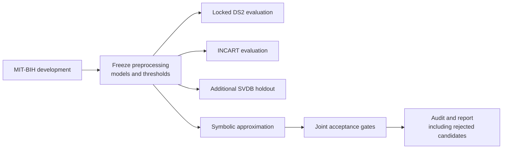

<div align="center">

# KAN × ECG
### Generalization and budget-constrained symbolic distillation

**Can a strong ECG classifier also become a compact, faithful equation?**


[**Download source**](KAN_ECG_Source_Code.zip) · [**Results**](#results-at-a-glance) · [**Reproduce**](REPRODUCIBILITY.md) · [**Contribute**](CONTRIBUTING.md)

Adil Sukumar · Somya Sisodia  
School of BioSciences, Engineering and Technology · VIT Bhopal University, India

</div>

## The question

Kolmogorov–Arnold networks learn functions on network edges. That architectural transparency does not automatically establish that a trained classifier can be compressed into a short, faithful symbolic rule.

We evaluate a **custom degree-one spline KAN on twelve engineered ECG features**, compare feature-matched baselines, and test symbolic approximations against explicit acceptance gates. The endpoint is **ventricular ectopic beat versus non-ventricular beat classification**, not end-to-end clinical arrhythmia diagnosis.

**Main finding:** classifier performance and explanation fidelity are different outcomes. No tested surrogate passed every acceptance gate; predictive rankings changed across cohorts.

## Results at a glance

Ventricular-class F1 at unchanged development-selected thresholds:

| Evaluation | Spline KAN | Random Forest | Interpretation |
| :--- | ---: | ---: | :--- |
| MIT-BIH locked internal DS2 | **0.8859** | 0.8664 | Higher KAN point estimate; paired uncertainty does **not** establish superiority. |
| INCART external evaluation | 0.8043 | **0.8457** | RF performs better under the frozen pipeline; paired KAN−RF F1 interval: **−0.0906 to −0.0029**. |
| SVDB additional holdout | **0.4256** | 0.3775 | Rankings change; MLP reaches 0.4291. Patient independence is unverified. |

These summarize archived experiments, **not a fresh rerun of this public release**. They do not establish universal architectural superiority or clinical deployment readiness.

### Symbolic fidelity is not decision agreement

| Experiment | Observed result |
| :--- | :--- |
| Original polynomial search | 14 candidates; none accepted; best probability-fidelity R² = **0.4449**. |
| Three-teacher objective ablation | 168 polynomial candidates; none accepted. |
| Dictionary-normalization extension | Another 168 candidates; none accepted; maximum KAN R² = **0.5523**. |
| Broader approximations | 18 additive and 3 edgewise fits; none accepted; maximum KAN additive R² = **0.6488**. |
| Simple numerical recovery controls | **24/24 passed** on specified synthetic targets, not ECG targets. |
| Conditional explanation stability | 30 bootstrap fits; mean polynomial feature-support Jaccard = **0.5667**. |

High decision agreement can coexist with poor probability fidelity. A rejected formula is a diagnostic approximation, **not an accepted explanation or clinical rule**.

## Study design



Distillation extensions are **exploratory follow-ups** specified after the original results were known, not prospectively registered confirmations. Their surrogate fits use development data and retain the original teachers.

### Five gates, one acceptance decision

| Validation gate | Requirement |
| :--- | :--- |
| Teacher-probability fidelity | R² ≥ 0.90 |
| Decision agreement | ≥ 0.95 |
| Ventricular sensitivity | ≥ 0.90 |
| Sensitivity loss relative to teacher | ≤ 0.03 |
| Expression complexity | ≤ 25 counted nodes |

All must pass together. Node counts include deployed operations and output transformations. The sensitivity-loss bound is a **study criterion**, not a clinically validated safety standard.

## Data and processing

| Dataset | Role | Evaluated cohort | Data source |
| :--- | :--- | :--- | :--- |
| MIT-BIH Arrhythmia | Development and locked DS2 | 44 records; 100,630 eligible beats | [PhysioNet](https://physionet.org/content/mitdb/1.0.0/) |
| St Petersburg INCART | External assessment | 75 records; 175,718 eligible beats; 32 source patients | [PhysioNet](https://physionet.org/content/incartdb/1.0.0/) |
| MIT-BIH Supraventricular Arrhythmia | Additional holdout | 78 records; 184,347 eligible beats | [PhysioNet](https://physionet.org/content/svdb/1.0.0/) |

The pipeline uses annotated beat centers, a fixed lead-selection rule, zero-phase 0.5–40 Hz filtering, annotation-centered windows, and twelve rhythm/morphology features. Imputation and standardization are fitted on training data only. **No raw-waveform CNN is evaluated.** Filtering and future-sample features make this an offline experiment, not an established real-time detector.

## Start here

1. Download and extract [KAN_ECG_Source_Code.zip](KAN_ECG_Source_Code.zip).
2. Read [REPRODUCIBILITY.md](REPRODUCIBILITY.md) before launching compute.
3. Inspect notebook settings and frozen protocols; obtain data directly from PhysioNet under its terms.
4. Run the staged workflow and retain the output directories expected downstream.
5. Run associated audits; distinguish a regenerated run from the original immutable evidence archive.

**Compute:** Phases 1 and 2 use CPU with internet enabled. The original combined Phases 3–5 configuration enables GPU and internet. Follow-ups are CPU-based; do not allocate GPU simply to run them. Check current Kaggle quotas first.

<details>
<summary><strong>Explore the source archive</strong></summary>

```text
02_Phase1_Preprocessing/
└── notebook/phase1_clean_preprocessing.ipynb
03_Phase2_Baselines/
└── notebook/phase2_clean_baselines.ipynb
04_Phase3_KAN_Symbolic/
├── notebook/remaining_clean.ipynb
├── notebook/remaining_phases.py
└── outputs/audit_remaining.py
09_Stronger_Followup/
├── run_*.py and audit_*.py
├── secondary_svdb_comparison.py
├── *_PROTOCOL.md
└── *_FINDINGS.md
README.md
SOURCE_MANIFEST.json
```

The ZIP contains **21 scientific source/protocol files**, plus its README and source manifest. Three notebooks have outputs cleared. Scripts retain their relative-path layout; this is not an installable package. Repository-level documentation supersedes the short README embedded in the historical ZIP; scientific source bytes are unchanged.

</details>

## Limitations worth reading

- **MIT-BIH is record-disjoint, not guaranteed patient-disjoint.** Records 201/202 share a source. A sensitivity analysis excludes record 202 without changing models or thresholds.
- **SVDB source-patient independence is unverified.** Its uncertainty uses record clusters; all 78 records used first-channel fallback.
- **Negative results are bounded.** Failure concerns these implementations, features, surrogate families and gates—not all KANs or all symbolic regression.
- **The release is code-only.** Raw signals, fitted models, participant-level predictions, private logs and the manuscript are absent. Some audits require archived artifacts not distributed here.
- **Verification has limits.** Source syntax checks were performed; this release was not newly reproduced end-to-end. Hashes verify bytes, not clinical validity.

## Authors and research status

**Adil Sukumar** — methodology, software, formal analysis, validation and ML experiments. [GitHub](https://github.com/adilsukumar) · [Website](https://www.adilsukumar.xyz/)

**Somya Sisodia** — literature investigation, manuscript writing, revision and formatting.

Both authors are Integrated M.Tech. students in Artificial Intelligence and Bioinformatics at VIT Bhopal University. No external funding or competing interests were reported.

**Citation:** [CITATION.cff](CITATION.cff) provides repository attribution. No accepted-publication status or article DOI is claimed. **License:** no reuse license has been selected; public visibility does not imply unrestricted reuse. Dataset terms are separate.

Questions about methods or reproduction? [Open an issue](https://github.com/adilsukumar/KAN-ECG-Research_Paper/issues) using [CONTRIBUTING.md](CONTRIBUTING.md). Never post patient-level information or credentials.
